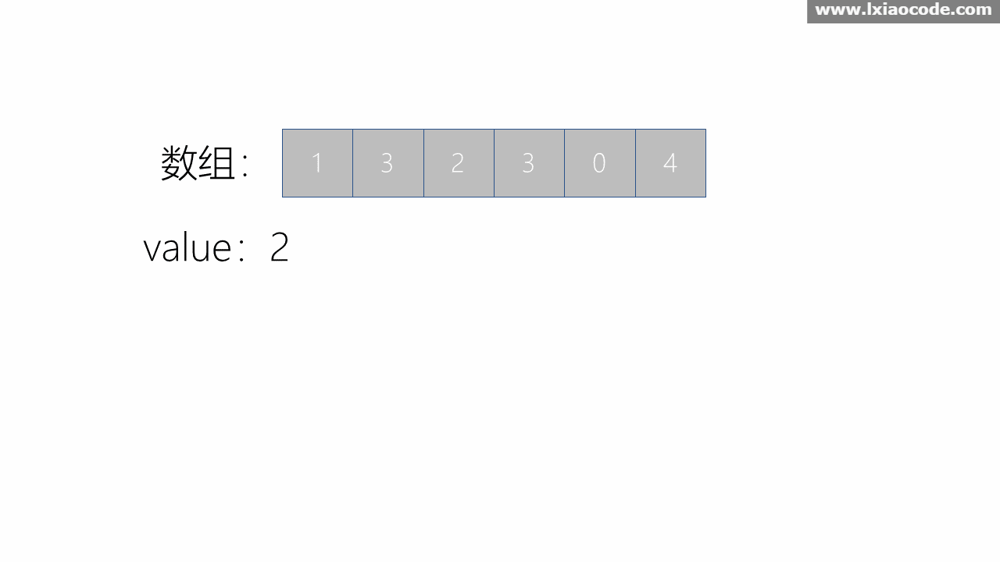

**[题目传送门](https://leetcode.com/problems/move-zeroes/)**

**题目描述**

给你一个数组 nums 和一个值 val，你需要 原地 移除所有数值等于 val 的元素，并返回移除后数组的新长度。

不要使用额外的数组空间，你必须仅使用 O(1) 额外空间并 原地 修改输入数组。

元素的顺序可以改变。你不需要考虑数组中超出新长度后面的元素。


**示例**
```html
给定 nums = [3,2,2,3], val = 3,

函数应该返回新的长度 2, 并且 nums 中的前两个元素均为 2。

不需要考虑数组中超出新长度后面的元素。
```

**方法一**

如果不考虑原地移除的话，我们可以新开辟一个数组，将不等于 val 的值移动到新数组中，然后再复制回去

时间复杂度 O(n)

空间复杂度 O(n)

```java
public class Solution {
    public int removeElement(int[] nums, int val) {
        int[] arr = new int[nums.length];

        int k = 0;
        for (int i = 0; i < nums.length; i++) {
            if (nums[i] != val) {
                arr[k++] = nums[i];
            }
        }
        System.arraycopy(arr, 0, nums, 0, k);
        return k;
    }
}
```

**方法二**

题目要求的是原地移除，我们可以定义快慢指针i, j，将非 val 元素向左边挪。当 `nums[i] = val` 时，i 自增，j 不变。当 `nums[i] != val` 时，nums[j] = nums[i]，i、j都自增。

时间复杂度 O(n)

空间复杂度 O(1)


```java
public class Solution {
    public int removeElement(int[] nums, int val) {
        int k = 0; 

        for (int i = 0; i < nums.length; i++) {
            if (nums[i] != val) {
                nums[k++] = nums[i];
            }
        }
        return k;
    }
}
```

**方法三**

当要删除元素很少时，比如 `nums=[1,2,3,4]`，`val=1` 时，以为题目说元素顺序可以改变，所以我们不需要将后面的元素都左移，而是将等于 val 的元素与最后一个元素交换。

时间复杂度 O(n)

空间复杂度 O(1)



```java
public class Solution {
    public int removeElement(int[] nums, int val) {
        int n = nums.length;
        int i = 0;
        while (i < n) {
            if (nums[i] == val) {
                nums[i] = nums[n - 1];
                n--;
            } else {
                i++;
            }
        }
        return i;
    }
}
```

以上图片来自 LeetCode 题解区